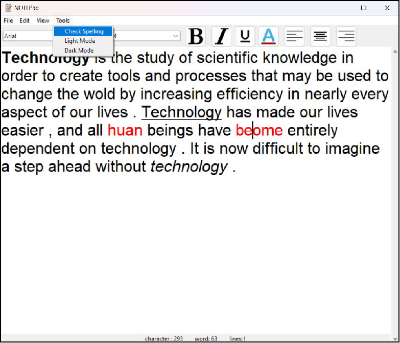

# 📝 Simple Notepad in Python

A lightweight notepad application built with Python and Tkinter that demonstrates the power of technology in simplifying everyday tasks. This tool combines essential text editing features with modern conveniences to enhance your productivity.

## 🌟 Technology Behind the Notepad


Technology represents the study of scientific knowledge to create tools and processes that transform our world by increasing efficiency in nearly every aspect of our lives. This notepad application exemplifies how technology:

- Makes text editing and formatting effortless
- Provides instant access to powerful formatting options
- Bridges the gap between simple concepts and powerful implementations

As with all technology, what begins as a convenience quickly becomes indispensable. It's now difficult to imagine text editing without such digital tools.

## ✨ Features

### Core Functionality
- Create, open, and save text files (.txt format)

### Text Formatting
- **Font styles**: Bold, italic, underline
- **Text alignment**: Left, center, right
- **Font customization**: 
  - Size adjustment (8pt to 72pt)
  - Family selection (system fonts)
  - Color palette with custom color picker

### Editing Tools
- **Spell Check**: 
  - Real-time error detection
- Find and replace text
- Undo/redo functionality

### View Options
- Light and dark mode toggle
- Word count statistics

## 🖼 Icons Reference

All icons are stored in the `icons/` folder:

| Icon | Function | Shortcut |
|------|----------|----------|
|  | Bold Text | Ctrl+B |
|  | Italic Text | Ctrl+I |
|  | Underline Text | Ctrl+U |
|  | Align Left | Ctrl+Shift+L |
|  | Align Center | Ctrl+Shift+C |
|  | Align Right | Ctrl+Shift+R |
|  | Font Color | Ctrl+F |

## ▶️ Installation & Usage

### Requirements
- Python 3.6+
- Tkinter (usually included with Python)
- Additional packages: `spellchecker` (install via `pip install pyspellchecker`)

### Running the Application
```bash
python Code.py
